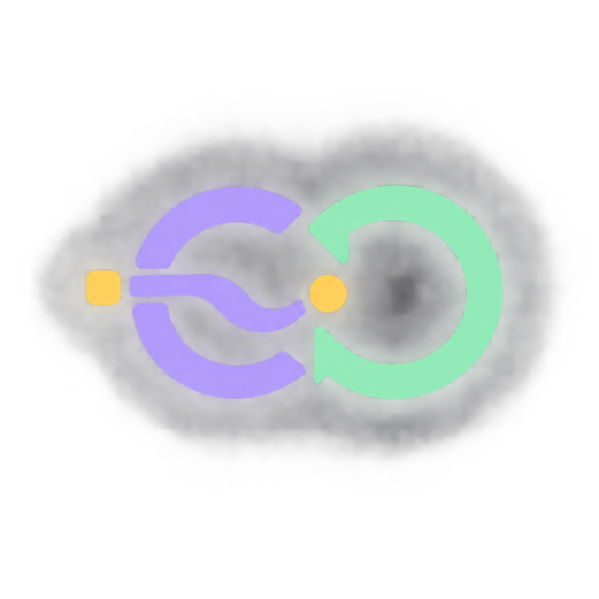
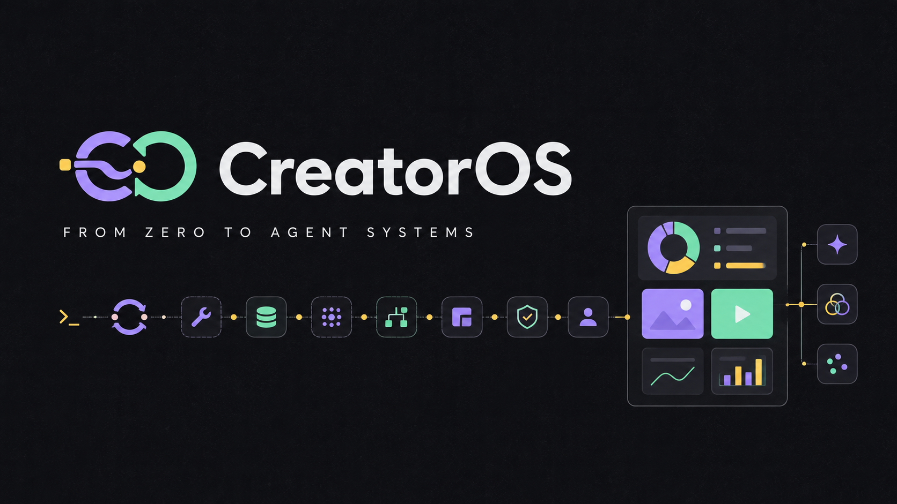

<p align="center">
  
</p>

<h1 align="center">CreatorOS</h1>

<h3 align="center">From the first Agent Loop to recoverable creator operations.</h3>

<p align="center">从零理解 Agent，直到真正运行一套可恢复、可验收、讲得清楚的内容生产系统。</p>

<p align="center">
  
  
  
  
  
</p>



<p align="center">
  <a href="#-what-it-does">What it does</a> ·
  <a href="#-how-it-works">Architecture</a> ·
  <a href="#-from-zero-to-interview-ready">Learning path</a> ·
  <a href="#-quick-start">Quick start</a> ·
  <a href="docs/architecture-guide/index.html">Architecture handbook</a>
</p>

---

## ✦ What it does

Give CreatorOS an account, a content series and an ordered topic list. It turns one selected topic into a traceable production run:

<p align="center"><strong>Creator / Series</strong> → <strong>Topic</strong> → <strong>Codex + Skill</strong> → <strong>SocialContentPack</strong> → <strong>Review / Revise / Approve</strong></p>

The operator keeps the final say. The system remembers the plan, runs content production outside the browser request, validates the artifact, and can resume an interrupted run instead of silently starting over.

| 🧭 Command Center | ♻️ Recoverable production | 🧠 Agent foundations |
| --- | --- | --- |
| Manage creators, series and ordered topics | Persist Run / Revision / Attempt / Event | Provider, Agent Loop, Tool Registry and Skills |
| Parse natural-language operations into a Preview | Resume the same Codex thread after interruption | Token budget, Tool Result projection and Compaction |
| Inspect image cards and approve the exact revision | Bind approval to the manifest and image digest | Session snapshot, Runtime Context and trace events |

> **The current finish line is an approved content package.** CreatorOS does not yet auto-publish to a platform or claim a closed-loop growth system.

---

## 🧭 Why CreatorOS?

Many Agent demos stop when the model returns something plausible. CreatorOS starts from the engineering problems that appear immediately after that demo.

| One-shot Agent demo | CreatorOS |
| --- | --- |
| A prompt directly mutates state | Structured plan → read-only Preview → explicit confirmation |
| One long request owns the whole task | Background execution with persisted ownership and heartbeat |
| “The model said it finished” | Pydantic contract + real file validation + artifact digest |
| Retry means start again | Technical retry resumes an Attempt; human revision creates a new Revision |
| Logs explain what happened | Final environment state decides success; trajectory explains why |

This is a **Workflow + Agent** design: deterministic workflow owns irreversible state transitions; the model handles language, ambiguity and dynamic decisions where intelligence is useful.

---

## ⚙️ How it works

### The product path

```text
Operator command
      │
      ▼
DeepSeek OperationPlanParser ── needs clarification / unsupported
      │ ready
      ▼
Read-only Preview ── explicit confirmation ── atomic database change
      │
      ▼
Creator → Series → ordered Topic
      │
      ▼
ContentRun → ManagedRunExecutor → CodexProducer + fixed Skill
      │                              │
      │                         persistent thread
      ▼                              ▼
Run / Revision / Attempt / Event → SocialContentPack
                                      │
                                      ▼
                              Inspect → Revise / Approve
```

### The learning Runtime underneath

```text
messages + RuntimeContext + Skill metadata
                    │
                    ▼
              ModelContext
                    │
                    ▼
DeepSeekProvider ↔ Agent Loop ↔ Tool Registry ↔ Pydantic ToolResult
                    │
                    ├── Session snapshot
                    ├── Token budget + CompactionCheckpoint
                    └── Streaming Agent events
```

The Web Studio does **not** pretend every database operation is a free-running Agent loop. It reuses the same engineering ideas but follows a safer hybrid path: LLM parsing at the boundary, then deterministic preview, confirmation and transaction execution.

[Open the full interactive architecture handbook →](docs/architecture-guide/index.html)

---

## 🪜 From zero to interview-ready

CreatorOS was built in small slices so every abstraction has a reason to exist—not because a framework happened to expose a class with that name.

| Stage | What was built | What you should be able to explain |
| --- | --- | --- |
| 01 · Call | One real model request, then explicit message history | What an API call does—and what it does **not** do |
| 02 · Act | Agent Loop, tool calls, Pydantic schemas and Tool Registry | Where model intelligence ends and the harness begins |
| 03 · Remember | State, Runtime Context, sessions, token budget and compaction | Why `messages`, runtime state and durable memory are different |
| 04 · Operate | Creator/Series/Topic, structured plans and confirmation | Why Agents and deterministic workflows belong together |
| 05 · Recover | Run, Revision, Attempt, checkpoint, lease and trace | How to resume safely without duplicate work or stale approval |
| 06 · Evaluate | Real end-to-end state is already testable; Agent Benchmark is next | Why final-state success and trajectory analysis answer different questions |

The repository keeps the learning trail in nearby `SPEC.md` files. For a guided explanation of the decisions, trade-offs and likely interview follow-ups, read the [CreatorOS architecture handbook](docs/architecture-guide/index.html).

---

## 🌱 Two business lines, one Runtime

### Main line · Original knowledge creators

CreatorOS manages an owned content series, selects a topic, and uses Codex as an end-to-end production tool. The fixed `knowledge-to-carousel` Skill produces a variable-length image carousel plus a strict `social_content_pack.json`; CreatorOS owns orchestration, storage, validation and approval.

### Experiment line · Hotspot-to-author routing

The retained PersonClone integration reads formal author routing profiles through FastAPI, embeds stable domain prototypes with locally cached BGE-M3, and uses per-author Max Similarity to build hotspot candidate queues. It does not read PersonClone files or Qdrant internals, and it is not the current publishing path.

These lines deliberately share infrastructure without being forced into one giant workflow.

---

## 🚀 Quick start

### 1. Install

```powershell
git clone https://github.com/SlamWeb/CreatorOS.git
cd CreatorOS
conda activate deepcode
pip install -r requirements.txt
pip install -r requirements-web.txt
npm --prefix web ci
```

### 2. Configure

Create a local `.env` file. It is ignored by Git.

```dotenv
DEEPSEEK_API_KEY=your_deepseek_key
DATABASE_URL=sqlite:///data/creatoros.db
CODEX_PRODUCER_TIMEOUT_SECONDS=1800
```

Natural-language planning requires `DEEPSEEK_API_KEY`. Real image production also requires a working local `codex login`. The optional PersonClone experiment has its own base URL and session cookie; never commit either credential.

### 3. Run

```powershell
python -m creatoros.web
```

Open [http://127.0.0.1:8765/](http://127.0.0.1:8765/). The same command builds the frontend when needed and serves the React/TypeScript Studio from FastAPI.

Optional CLI entry:

```powershell
python .\main.py
```

---

## 🎬 Three-minute demo

1. Create a Creator and a Series, then add an ordered topic list.
2. Press `Ctrl+K` and describe a batch change in natural language.
3. Inspect the generated Preview and confirm it; no business state changes before confirmation.
4. Start one topic. Continue browsing while Codex produces the carousel in the background.
5. Open the Run Inspector, compare revisions, request one revision, then approve the exact artifact shown.
6. Restart CreatorOS and reopen the same Run to show persisted state, artifacts and trajectory.

The real S7 delivery test recovered an interrupted Codex thread and produced a seven-card package in an isolated database/output directory. Nothing was published externally.

---

## ✅ Current boundary

| Capability | Status |
| --- | --- |
| Python Agent Runtime + real DeepSeek streaming/tool loop | ✅ Working |
| React/TypeScript Studio, natural-language Preview and confirmation | ✅ Working |
| Recoverable Codex content production and artifact approval | ✅ Working |
| PersonClone hotspot/domain routing experiment | ✅ Working |
| Perspective reranking and production quality judge | ◐ Planned experiment |
| Agent task Benchmark based on final state + trajectory | ◐ Next engineering milestone |
| Automatic platform publishing and performance feedback | ○ Not implemented |
| Public MCP Server and automatic long-term memory retrieval | ○ Not implemented |

<details>
<summary><strong>Verification commands</strong></summary>

```powershell
conda run --no-capture-output -n deepcode python -m tests.smoke_studio_delivery
conda run --no-capture-output -n deepcode python -m compileall -q main.py creatoros tests
npm --prefix web run typecheck
npm --prefix web run build
npm --prefix web run e2e
```

Live tests are kept separate because they may consume DeepSeek/Codex usage. They use isolated databases and output directories and never publish content.

</details>

---

## 🗂️ Repository map

```text
creatoros/
├── ai/             providers, streaming and model context
├── agent/          loop, state, guard and compaction
├── tools/          registry, Pydantic arguments and ToolResult
├── operations/     structured plans, preview and confirmation
├── runs/           recoverable content-run state machine
├── storage/        SQLAlchemy repositories and Alembic entry
├── integrations/   DeepSeek, Codex, Zhihu and PersonClone boundaries
├── routing/        author-profile projection and domain retrieval
├── skills/         discoverable Prompt Skills and fixed production skill
└── web/             FastAPI Studio API

web/                 React + TypeScript operator Studio
docs/                architecture handbook and staged engineering specs
tests/               smoke, browser E2E and opt-in live verification
```

---

## 🧪 What comes next

The next milestone is not another UI page. It is a small, real **Agent Eval** suite:

```text
initial database state + operator request
                    ↓
             Agent / Workflow run
                    ↓
expected final state + forbidden side effects + trajectory + token cost
```

It will compare free-form execution with Workflow/Skill-assisted execution on ambiguous edits, stale confirmation, interruption recovery and tool-selection bad cases. Product smoke tests answer “does the feature work?”; the benchmark will answer “does the Agent reliably finish the task, by a defensible path, at a reasonable cost?”

---

## ✦ Philosophy

### Build the abstraction only after meeting the problem.

No framework-shaped architecture for its own sake.<br>
No model output accepted as proof of completion.<br>
No irreversible action hidden behind a friendly prompt.<br>
No “memory” claim without retrieval changing a later decision.

**Start with one loop. End with a system you can operate—and explain.**

<p align="center">
  <a href="docs/architecture-guide/index.html">Read the architecture handbook</a> ·
  <a href="docs/studio/SPEC.md">Read the Studio SPEC</a> ·
  <a href="https://github.com/earendil-works/pi">Pi reference</a>
</p>
