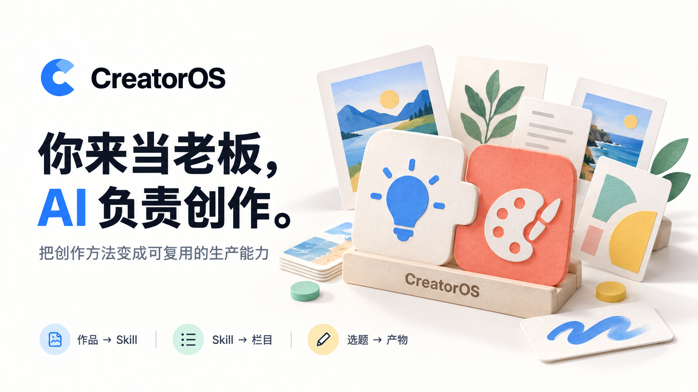

<p align="center">
  
</p>

<h1 align="center">CreatorOS</h1>
<p align="center"><strong>你来当老板，AI 负责创作。</strong></p>
<p align="center">把创作方法变成 Skill，把 Skill 组合成栏目，把选题交给 AI 生产。</p>

<p align="center">
  
  
  
  
</p>



<p align="center">
  <a href="#features">能做什么</a> ·
  <a href="#start">快速开始</a> ·
  <a href="#use">第一次创作</a> ·
  <a href="#architecture">如何工作</a> ·
  <a href="#limits">当前边界</a>
</p>

CreatorOS 是一个开源、本地运行的 AI 内容创作工作台，面向需要管理多个账号、多个栏目的个人创作者和小团队。

你决定账号定位、栏目组合、选题和交付标准；运营 Agent 负责查询、规划与工具调用，Codex 作为生产执行者。Web 手工操作与 Agent 自然语言操作通向同一套服务和数据。

不必每次从空白聊天开始：创作方法可以复用，栏目与选题长期保存，每次产物都有自己的版本、生产记录和验收入口。

<a id="features"></a>

## ✨ 能做什么

### 🧩 把作品变成可复用的 Skill

上传图片、一组图片或有特色的文案，提炼能用于**新主题**的创作方法，而不只是复刻原图的 Prompt。

支持提炼一份完整 Skill、仅内容方法、仅呈现方法，或内容与呈现两份 Skill。工作台可查看 `SKILL.md` 与参考 assets、编辑正文、让 Codex 按要求改稿，再输入选题试做；满意后确认入库。试做需要你主动发起，不会偷偷开始生图。

### 🎨 组合方法与风格，建立自己的栏目

| Skill | 负责什么 | 例子 |
| --- | --- | --- |
| Mind · 内容方法 | 选材、调研、解释、叙事与知识组织 | 把一个技术主题讲成循序渐进的故事 |
| Visualize · 呈现方法 | 角色、风格、版式与表达形式 | 用“小白”IP 制作技术图解 |
| 完整 Skill | 已成熟的端到端创作方法 | 用统一情境漫画解释易混英语词 |

在 Skill 页选择或拖动内容 Skill 与呈现 Skill，填写定位、受众并创建栏目，再分配给账号。一份内容方法可以搭配不同风格，一套呈现方式也可以服务不同栏目。

组合保留两份原 Skill，不强行拼成一个文件。双 Skill 生产前检查协作要求：能适配的默认偏好允许调整，无法兼容的硬要求停下来让你决定。当前生产交付以图片轮播为主。

### 💬 手动管理，或直接使唤 Agent

用界面管理账号、栏目和选题，也可以在总览或账号对话里提出要求：

- “这个账号有哪些栏目，各自绑定了什么 Skill？”
- “看看这个栏目的待选内容，帮我挑三条，先给我预览。”
- “把队列里的这条选题交给 Codex 生产，再查一下进度。”

账号会话绑定固定账号，默认上下文只带账号 → 栏目 → Skill 名称与简介，更多运营数据按需查询。服务端检查资源归属；查看或建议不会因为一句模糊指令就自动开始生产。

### 📦 看得见过程，接得住产物

每次生产独立记录任务、尝试和内容版本。页面展示阶段、最近活动与已核验的部分图片；验收时查看成图、内容稿和生产器报告的生图 Prompt，决定批准或返工。

选中的本地 Skill 在执行时冻结；失败保留文件与检查点，符合恢复条件的任务可显式恢复，交付索引修复有上限，不自动反复重画。批准后可下载发布包，手动发布到小红书，再登记笔记链接与分时指标。**批准不等于已经发布。**

<a id="start"></a>

## 🚀 快速开始

### 准备环境

- Python **3.11+**；当前 Codex Python SDK 要求 Python ≥ 3.10。
- Node.js **22.12+** 与 npm、Git。
- DeepSeek API Key：用于运营 Agent 与自然语言计划解析。
- 本机可正常使用的 Codex 登录态：用于调研、Skill 提炼与生产。生图是否可用取决于你的账号和本地 Codex 环境，不承诺所有订阅都能运行。

CreatorOS 默认只监听 `127.0.0.1`，无需部署网站，也不要求启动 PersonClone。模型调用会消耗对应服务的额度。

### 1. 下载与安装

在 PowerShell 中执行：

```powershell
git clone https://github.com/SlamWeb/CreatorOS.git
cd CreatorOS
python -m venv .venv
.\.venv\Scripts\python.exe -m pip install -r requirements.txt -r requirements-web.txt
npm --prefix web ci
```

Linux/macOS 将 Python 路径替换为 `.venv/bin/python`。始终在仓库根目录运行命令；否则可能出现 `No module named 'creatoros'`。

### 2. 配置

在仓库根目录创建 `.env`：

```dotenv
DEEPSEEK_API_KEY=your_deepseek_key
```

默认使用本地 SQLite。如需自定义，可增加：

```dotenv
DATABASE_URL=sqlite:///data/creatoros.db
CODEX_PRODUCER_TIMEOUT_SECONDS=1800
```

`.env` 已被 Git 忽略。不要把 API Key、密码或 Cookie 放进 Skill、截图或提交。Codex 的登录由本地 Codex 管理，不需要把账号密码填写到 CreatorOS。

### 3. 启动

```powershell
.\.venv\Scripts\python.exe -m creatoros.web
```

打开 **http://127.0.0.1:8765**。启动器会在需要时构建前端并升级数据库；首次启动可能稍慢。新安装不会自动导入开发者的账号或运营数据。

更换端口可加 `--port 8876`；停止服务用 `Ctrl+C`。

<a id="use"></a>

## 🪄 第一次创作

1. **创建账号**：在「栏目」工作台创建你要运营的账号。
2. **准备 Skill**：在「Skill」页输入 GitHub Skill 链接并选择角色；也可以「从作品提炼」，查看、修改草稿后确认入库。
3. **建立栏目**：组合 Mind 与 Visualize，填写栏目名称、定位和受众，选择归属账号。已有完整 Skill 也可绑定为单 Skill 栏目，不必强行拆分。
4. **安排选题**：进入栏目手动添加，或提交调研。调研候选与正式生产队列分开，选中并确认后才入队。
5. **开始生产**：对选题点击「生产」，在同一任务详情查看进度。可以离开页面再回来，不需要重新提交。
6. **验收交付**：看图片和文案，不满意就明确提出返工；满意后批准、下载发布包。人工发布后回填链接及阅读、点赞、收藏等数据。

想用自然语言操作，进入「Agent」；工作台的「账号 Agent」入口会绑定当前账号。总览适合平台级 Skill 管理和跨账号查看，账号对话适合该账号的栏目与选题操作。

<details>
<summary>可选：从 CLI 与同一个 Studio 对话</summary>

先保持 Studio 运行，再开一个终端：

```powershell
.\.venv\Scripts\python.exe main.py --agent --studio-url http://127.0.0.1:8765
```

CLI 与 Web 复用 Agent Loop 和业务接口，但聊天记录不是自动合并的。

</details>

<a id="architecture"></a>

## ⚙️ 如何工作

```text
Web 表单 / 拖拽 ───────────────┐
                              ↓
Agent → 工具调用 ───────→ 共用业务服务 → SQLite / 本地 Skill 库
                              ↓
                         ContentRun 任务
                              ↓
                  Codex · 选中的 Skill · 独立 thread
                              ↓
                  内容 / Prompt / 图片 / 生产证据
                              ↓
                    人工验收 → 发布包 → 手动反馈
```

**运营与生产各司其职。** Python Runtime 调用 DeepSeek 完成工具循环、上下文管理与业务决策；Codex-as-Tool 读取选中的本地 Skill，执行内容生产。新生产任务用新 thread，技术恢复才在校验输入后续接同一任务。

**完整会话不等于模型上下文。** 原始消息和工具结果作为账本保存；模型看到的是预算内的投影：稳定指令、滚动摘要、近期原文、当前账号能力树。大工具结果可外置成文件索引，按需回读；请求用量、压缩与工具轨迹可追溯。

**Skill 属于 CreatorOS。** GitHub 是来源，本地副本才是实际调用对象，可以修改；生产使用冻结快照。不会把上传的 Skill 安装到你的全局 Codex Skill 目录。显式传路径并不等于完全屏蔽 Codex 环境中已有的全局 Skill。

### 本地文件放在哪里？

| 位置 | 保存内容 |
| --- | --- |
| `data/creatoros.db` | 账号、栏目、选题、生产任务、人工发布记录与指标 |
| `data/producer-skills/` | Skill 登记、可编辑 working 副本、提炼草稿及试用记录 |
| `data/creatoros-agent-sessions/` | 默认 Web 会话账本、摘要检查点与 Context Trace |
| `outputs/` | 生产版本、内容、Prompt、图片及交付证据 |
| `sessions/` | CLI 会话 |
| `tmp/` | 隔离验证与本地实验材料 |

表中为默认位置；自定义数据库时，相关 Web 会话及 Skill 目录跟随数据库所在目录。运行数据不会随仓库分发，分享前检查是否含个人内容或敏感信息。

<a id="limits"></a>

## 🧭 当前边界

CreatorOS 仍在持续开发。它已经能管理创作方法与生产任务，但不是“上传任何作品就能稳定复制成功”的黑盒，也不是无需验收的自动 MCN。

- **交付范围**：当前生产与验收支持图片轮播；文字素材可提炼为 Skill，不代表已提供独立纯文本或视频交付器。
- **提炼质量**：草稿需要人检查、试用与迭代，不保证从一张作品还原作者的完整创作方法或生成完全一致的角色。
- **发布与反馈**：支持人工发布登记和手填指标；尚无自动发布、自动抓取平台数据或反馈驱动的自主运营闭环。
- **账号隔离**：作用域用于本机防误操作，不是公网多租户认证；目前没有跨会话的自动长期偏好记忆。
- **恢复与速度**：依赖可核验文件和检查点，不保证外部工具恰好执行一次；单 thread 生产不等于并发生图。

已有小型运营任务与上下文评测，使用隔离数据库、真实模型调用及终态判分，也保留失败案例。它们不是整条调研—生图—发布链路的成功率证明：[运营保留集结果](docs/agent-eval/HOLDOUT-RESULTS.md) · [上下文对照结果](docs/context-management/C4-RESULTS.md)。

## 📚 深入了解

- [作品提炼工作台](docs/artifact-to-skill/SPEC.md)：草稿、改稿、试用与确认入库。
- [栏目组合](docs/studio/composition/SPEC.md) / [原生单 thread 生产](docs/single-thread-production/SPEC.md)：Skill 协作、冲突处理、冻结与恢复。
- [账号 Agent](docs/agent-studio/web-chat/SPEC.md)：会话绑定、作用域与账号上下文树。
- [上下文管理](docs/context-management/SPEC.md)：预算、滚动摘要、完整记录与 Trace。
- [人工发布与反馈](creatoros/publication/SPEC.md) / [运营评测](docs/agent-eval/SPEC.md)。
- [当前项目进展](SPEC.md) / [前端验证工作流](web/FRONTEND_WORKFLOW.md)。

<details>
<summary>开发者：本地验证与项目目录</summary>

以下 smoke 使用本地变换、隔离数据或受控故障，不主动发起收费调研、生图或发布。真实模型测试单独运行，并应先阅读对应 SPEC 的预算和副作用说明。

```powershell
.\.venv\Scripts\python.exe -m tests.smoke_skill_draft_files
.\.venv\Scripts\python.exe -m tests.smoke_native_production
.\.venv\Scripts\python.exe -m tests.smoke_account_context
npm --prefix web run typecheck
npm --prefix web run build
```

```text
creatoros/         Runtime、业务服务、工具、集成与 Web API
web/               React / TypeScript 工作台
production-skills/ 仓库自带的生产 Skill 源文件
migrations/        SQLite 数据库迁移
tests/             Smoke、隔离夹具与真实 API/Eval 入口
docs/              模块设计、验证结果与项目文档
```

</details>
