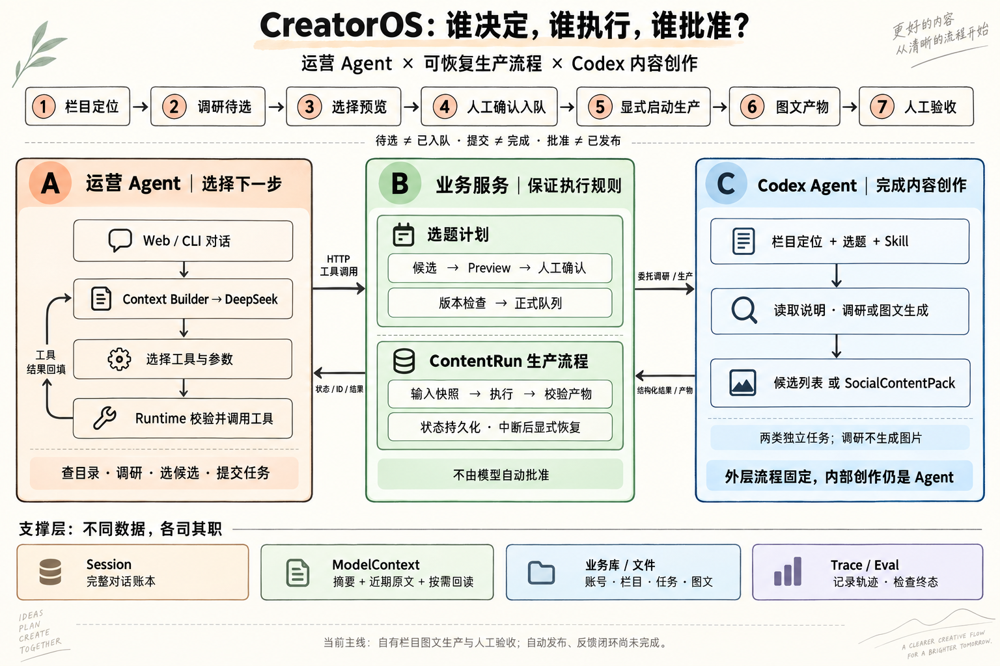

# CreatorOS：把项目重新变成你能解释的东西

核对时间：2026-09-18；依据代码42f640c。此页为当前导览，旧index.html保留早期设计记录，不作为最新能力清单。

图是概念地图，不是函数级调用图。调研与生产是两类独立Codex任务：调研输入栏目定位、受众、Skill及已有选题，不要求先选定下一篇topic；生产才输入确定的选题。ModelContext还包含系统说明与工具schema，图中底栏只概括动态部分。

## 先纠正两处容易讲错的地方

1. “管理多个账号”是业务价值；“扩展性好”必须拿具体机制证明，例如栏目绑定不同生产Skill，产出遵守统一契约，运营层不必写每个栏目的生成逻辑。不等于已经验证无限账号或高并发，目前生产执行器容量为1。
2. Agent与Workflow不是按“选题前/选题后”切两半。前者让模型根据目标与结果决定下一步；后者由代码规定状态迁移、校验和执行边界。Workflow内部可以调用Codex Agent，外层流程可控不等于内部生成确定。

当前适合说“自有账号、多栏目的内容生产与人工验收”，不适合说已经全自动发布运营。旧PersonClone/知乎线路保留，是另一条实验业务线，不是当前图文主线的必经步骤。

## 一条任务，走过三个角色

用户：“给架构小课找几个选题。我选第二和第四个，先给我看，不要生产。”

1. **运营Agent**查询真实账号和栏目，消解同名对象；用户授权调研时调用research_series_topics。它不会通过想象填入业务ID。
2. **调研服务**委托Codex独立调研并保存候选批次；候选带标题、切入点和来源。任务提交后返回状态/链接，不让聊天循环一直等待。
3. 用户随后指定选择，Agent用prepare_topic_selection传入真实batch_id与有序candidate_id；服务校验并创建待确认Preview。
4. **用户**在页面核对并确认，业务服务重新检查版本/配置后入正式队列。Agent的“已准备”不是确认权限。
5. 用户再明确要求生产已有选题，Agent可调用start_content_run(topic_id)；服务读取栏目与选题快照，登记并提交ContentRun，立刻返回run_id。
6. **生产执行器**在后台委托Codex；Codex按生产Skill自主完成图文，返回结构化回执。CreatorOS整理SocialContentPack并验证文件与结构，记录版本/尝试/状态。
7. **用户**在Run页验收、返工或批准。产物文件有效不等于知识准确；批准也不等于已发布。

重要区分：两次人的关口分别是“这份选题计划允许写入吗”和“这份生成内容满意吗”。不是所有读取都要确认；也不是一个Preview包办所有后续动作。

## 模块到代码：按这个顺序读

| 模块 | 一个直观问题 | 最小入口 | 本轮不用深挖 |
|---|---|---|---|
| A. 运营Agent | 用户说第二条，谁决定查哪个列表？ | [Web规则与工具白名单](../../creatoros/web/chat.py)、[Loop](../../creatoros/agent/loop.py) | Provider适配的全部细节 |
| B. 工具边界 | 模型返回名字和参数后，谁真正调用HTTP？ | [Studio工具](../../creatoros/tools/studio.py)、[HTTP客户端](../../creatoros/integrations/studio.py) | 一次背下全部工具 |
| C. 选题与确认 | Preview和正式Topic为什么不同？ | [候选服务](../../creatoros/web/research_routes.py)、[计划服务](../../creatoros/operations/service.py) | 每个状态枚举 |
| D. 生产生命周期 | 聊天结束，为什么生成还能继续？ | [后台执行器](../../creatoros/runs/executor.py)、[Run服务](../../creatoros/runs/service.py) | 分布式调度 |
| E. Codex生产 | topic和Skill进来，什么结果算可验收？ | [Codex适配器](../../creatoros/integrations/codex.py)、[产物验证](../../creatoros/runs/artifacts.py) | 把Codex内部当作自己写的Runtime |
| F. 上下文 | 历史完整保存，为什么模型不必每次全看？ | [上下文SPEC](../context-management/SPEC.md)、[压缩器](../../creatoros/agent/compactor.py) | 长期向量记忆 |
| G. 评测 | 回复“好了”和任务完成如何区分？ | [终态grader](../../tests/operating_eval_grader.py)、[真实结果](../agent-eval/HOLDOUT-RESULTS.md) | 通用榜单排名 |

### 实际入口不是完全统一的万能聊天

- Web/CLI复用Loop和工具协议，不代表两端开放的工具/Skill权限完全相同，也不代表共用同一个会话。
- Web可查询账号/栏目/选题，调研，选候选生成Preview，提交已有选题生产和查询Run等；没有通用账号/栏目CRUD工具供它随意创建一切。
- 普通新增/调整选题使用独立运营指令入口：OperationPlanParser解析→PendingOperation→人工确认→代码执行。不要讲成每个Web聊天请求都经过该Parser。
- 研究候选选择有专用prepare_topic_selection，保留来源与配置约束；两条路径复用计划/确认服务，不是同一个自由编辑入口。
- 生产Skill主要交给Codex读取执行。CreatorOS自身也有SkillLoader，但Web read_file限制在当前会话归档，不因此注入任意本地Skill文件。

## 还理解债：五次短课，而不是再堆功能

每次都做：**先预测 → 看一个真实结果或短代码 → 解释差异 → 不看资料复述**。每次只加一个概念；若要改代码，最多先给5–20行，不替你一次改完整模块。

| 次序 | 这次只学什么 | 亲手完成的动作 | 过关标准 |
|---|---|---|---|
| 1 | 决策权与执行权 | 用“选第二条但别生产”在图上标出模型、代码和人的动作 | 不再把工具调用=自动批准，或Workflow=不用模型 |
| 2 | 一次工具往返 | 只读查询已有栏目；找出一条tool_call和对应result | 说出工具名、参数、真实执行者、结果怎样回模型 |
| 3 | Session与Context | 对照一份隔离评测Session和实际request快照 | 找到原文、摘要、近期消息，解释为何两份内容不同 |
| 4 | ContentRun与恢复 | 用现成隔离测试观察重复启动/中断，不重复付费生图 | 分清聊天session_id、业务run_id、Codex thread_id |
| 5 | 终态与Badcase | 阅读H05一次失败轨迹，先预测应否调用工具 | 分清查不到信息、状态陈旧、参数错误、执行失败 |

读代码每次只问四件事：输入是什么？谁作决定？修改了哪份状态？失败后谁知道？不要按文件夹顺序从头背。

## 面试题1：你原回答怎么变得更具体

保留你的真实动机：观察到可复用的图文内容生产方式，想把它扩展为多账号、多栏目管理。删去“注意力杠杆、空间巨大”等无法验证的陈述，换成产品约束和工程选择。

可用骨架（需要用自己的话复述，不当背稿）：

> CreatorOS面向管理多个自有账号和栏目的内容运营者。用户通过自然语言查询和选择选题，系统维护候选、正式队列、生产任务与产物版本，委托Codex按栏目Skill完成图文创作，最后由人验收。相比单次打开Codex，它解决的是任务与内容的持续管理，而不是再造生成模型。我的核心取舍是把运营管理留在CreatorOS，把创作委托给已有Agent；同时保留人的确认权，不把生成完成当作允许发布。

## 面试题2：你原回答缺的那一步

你说“模型决定添加栏目、添加选题”，描述的是动作类别，不是系统怎么决定。更重要的是：模型提出下一次工具调用，Runtime执行，业务服务校验，人持有批准权。

> 我的混合架构不是前半段Agent、后半段纯代码。运营Agent处理自然语言指代、选择工具并根据返回结果决定下一步；代码负责参数校验、计划预览、确认后的状态变更，以及ContentRun的提交、恢复和产物校验。生产流程内部又把创作委托给Codex Agent。所以固定的是业务边界和生命周期，不是要求模型按一条永远不变的思考路径生成内容。

## 当前最值得理解的失败，不是新功能

保留集H05六次都没有刷新已变化的栏目状态：旧结果的stale=false被当成了当前事实。它不需要更复杂Memory就能暴露问题：**历史帮助理解用户指代，当前业务事实要向持久状态核验。** 这是已发现但尚未修复的Badcase。

H06受控压缩后续办六次通过，只证明该场景接线和行为正确；没有证明1M自然长任务或压缩必然节约成本。讲清这些限制比背一个通过率更重要。

## 第一课停在这里

用户：“把刚才第二个候选加进计划，先别入队，更不要生产。”

请只回答三句话：模型决定什么？程序应该做什么？哪些动作必须停住等用户？

本页不预先开展生产测试或调整Runtime。下一课根据你的答案决定，不一次发十道题。

图由内置image_gen生成，已目视核对关键标签、主流程及模型/代码/人职责；生成提示词见[architecture-prompt.txt](architecture-prompt.txt)。图为解释性简化，以本文及代码为准。
