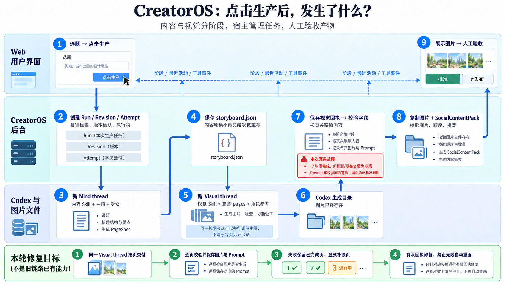

# 点击生产后，发生了什么？

## 旧链路为什么脆弱

Claude Code 选题已生成 7 张图且 SDK turn 完成，网页仍 failed，不是模型一直没画完。

1. 视觉 prompt 要求只负责视觉，回执却继承包含 headline、发布 title/body 的完整生产 schema。模型用空格占位；JSON Schema 的 minLength=1 与 Pydantic 去空格后非空校验不一致，9 个字段失败。
2. 角色参考实际传入正确，但回执路径为 `skills/production/assets/character.png`，验收以 Skill 根目录为基准，期望 `assets/character.png`。
3. 原来直到最后整组 JSON 才复制图片、生成 Manifest。图像文件存在，不代表 CreatorOS 已经持久化了可验收的产物。
4. 执行器心跳仅说明服务持有任务，SSE 仅说明网页连通；它们不能证明 Codex 正在推进。需要实际事件、最近活动与已交付页数。

## 真实主链路

1. Web 显式开始生产，或 Agent 调同一业务服务；刷新页面不会重复提交生产。
2. ContentRunService 做幂等、版本与执行所有权检查，保存 Run / Revision / Attempt 和冻结输入、两份 Skill。
3. 新 Mind thread：只读取内容 Skill，结合题目、受众、范围调研，交付完整 Storyboard。
4. 宿主保存 `storyboard.json` 与 `storyboard.md`，视觉阶段不能重写内容原件。
5. 新 Visual thread：只注入制作 Skill。第一 turn 根据整篇内容定稿视觉 Prompt；后续每页一个 turn，始终在这个视觉会话中。不是每张图新开 thread。
6. Codex image tool 写入其本地 generated_images 目录；返回实际文件路径。执行模型是 gpt-6-luna/xhigh；内置 imagegen 没有本项目可设置的“2.5”参数。
7. **本轮新增**：每页返回小回执；宿主验证顺序、文件归属、解码与字节摘要，立即复制到 Attempt 的 `partial-images/`，原子更新 checkpoint，保存逐页 Prompt。完整的请求、回复与安全事件记录在 Attempt。
8. 全部页完成后，由原 Storyboard 与已核验图片组成 SocialContentPack，复制最终图片、验收文件、顺序、证据和摘要；展示字段及发布文案草稿由原内容派生，不再让视觉模型占位。
9. Web 显示最终产物，用户逐页检查、返工或批准。批准不等于发布；制作中图片单独标为未验收。

图上绿色栏是相对旧链路的修复目标；本轮实现结果以模块 SPEC 为准。箭头按 1→2→3→4→5→6→7→8→9 读取，虚线仅表示进度观察，不是另一条执行链路。

## 保存、恢复与返工上限

- 图片、原内容、视觉计划、输入与冻结 Skill digest 一致才可恢复；拒绝跨 Run / Revision 或改变文件后的隐式复用。
- 技术恢复由用户显式触发，新 Attempt、新 Visual thread，显式带入本篇内容与原计划；已完成图片复制并校验，只生成缺页。不是恢复旧会话的隐式记忆。
- 人工返工新 Revision 默认重新制作，不偷偷沿用旧图。
- 每页最多补交一次无生图 JSON 回执；再次失败立即结束。网络或额度错误不自动开启新生图。
- 阶段有总时限，取消与超时通知 SDK interrupt，并有限等待；已交付页保留。最近没有事件只显示观察不新鲜，不武断判定图像请求已死。
- “只生图一次、不为审美重画”是对 Codex 的 prompt 约束，不能宣称宿主已拦截其全部内部生图调用。需要硬控制时才考虑拆成外部受控渲染器。

## 如何定位问题

| 文件 | 回答什么 |
|---|---|
| production_request.txt / skills/ | 本次输入与实际冻结 Skill 是什么 |
| storyboard.json / storyboard.md | 内容阶段产出了什么 |
| visual_plan.json | 本篇完整视觉计划是什么 |
| visual_page_NN_request.txt / response.txt | 这页给模型什么、模型返回什么 |
| pages/NN/content.md / prompt.txt | 最终交付内容与生产器报告的 Prompt |
| visual_checkpoint.json / partial-images/ | 哪些图片已持久化、来自哪个 thread |
| production_progress.json / codex_trace.jsonl | 当前阶段、最近事件、工具活动与 usage |
| social_content_pack.json / images/ | 网页最终验收的产物 |

Prompt 为生产器报告值，不等于图像服务内部改写后的最终文本。Trace 是白名单事件，不记录模型内部思考全文。

## 图像制作说明

使用本会话内置 imagegen 生成，不宣称已选择 GPT Image 2.5。初稿按真实九步流程分为 Web、CreatorOS 后台、Codex 与图片文件三条泳道；红框说明本次实际失败；绿栏说明本轮修复目标。两次局部编辑仅修正主链路箭头，未重写步骤。最终图人工核对箭头无跳步，保留生成源文件。

编辑约束：保留文字、卡片与布局；主链路只连 1→2→3→4→5→6→7→8→9；删除 2→4、3→5、5→4、4→7 捷径。
